  

  

 

<strong>EMBER COMMAND</strong> · original profile system · generated from GitHub public data

---

### Deploy this style

Everything required to customize and install this profile is in [SETUP.md](./SETUP.md). The artwork is generated locally, uses no paid API, and does not depend on a third-party stats-card service.
