<h3><code>abolfazl@github ~ $ ./contributions.sh</code></h3>

  

<h3><code>abolfazl@github ~ $ whoami</code></h3>

<pre>
┌─────────────────────────────────────────────────────────────┐
│  👤 Name:       Abolfazl (ابوالفضل)                      │
│  📍 Location:   Iran                                      │
│  💼 Role:       Developer & Open Source Enthusiast       │
│  🎯 Focus:      Coding, Learning, Building               │
│  🌱 Learning:   Always exploring new technologies         │
│  💬 Ask me:     Anything tech-related!                   │
│  ⚡ Fun fact:   I love turning ideas into code! 🚀       │
└─────────────────────────────────────────────────────────────┘
</pre>

 

<h3><code>abolfazl@github ~ $ skills --list</code></h3>

  
  
  
  
  
  
  
  
  
  

 

<h3><code>abolfazl@github ~ $ stats --show</code></h3>

  
  

 

<h3><code>abolfazl@github ~ $ ls -la projects/</code></h3>

<table>
  <tr>
    <td width="50%">
      <h4>🚀 Project One</h4>
      
An awesome project that solves real problems

      

        <a href="https://github.com/abolfazl/project-one">🔗 Repository</a> •
        <a href="https://project-one.com">🌐 Demo</a>
      

    </td>
    <td width="50%">
      <h4>🛠️ Project Two</h4>
      
Another amazing tool for developers

      

        <a href="https://github.com/abolfazl/project-two">🔗 Repository</a> •
        <a href="https://project-two.com">🌐 Demo</a>
      

    </td>
  </tr>
  <tr>
    <td width="50%">
      <h4>📱 Mobile App</h4>
      
Cross-platform mobile application

      

        <a href="https://github.com/abolfazl/mobile-app">🔗 Repository</a>
      

    </td>
    <td width="50%">
      <h4>🤖 AI Tool</h4>
      
Machine learning and AI experiments

      

        <a href="https://github.com/abolfazl/ai-tool">🔗 Repository</a>
      

    </td>
  </tr>
</table>

 

<h3><code>abolfazl@github ~ $ achievements</code></h3>

  

 

<h3><code>abolfazl@github ~ $ cat contact.txt</code></h3>

  
  
  
  
  
  

 

<h3><code>abolfazl@github ~ $ fortune</code></h3>

  <i>"The only way to do great work is to love what you do."</i> — Steve Jobs
   
  <i>"Code is like poetry; it should be clean, elegant, and meaningful."</i> — Abolfazl

 

<b>🇮🇷 فارسی / Persian</b>

 

سلام! من ابوالفضل هستم، توسعه‌دهنده نرم‌افزار و عاشق دنیای متن‌باز. 
 
این پروفایل من در گیت‌هاب است. خوشحال میشم با من در ارتباط باشید! 🚀

 

<code>contrib-heatmap.svg</code> is re-scraped and re-rendered every day by <a href="./.github/workflows/update-profile-art.yml">a GitHub Action</a>. Everything above is generated by <a href="./scripts">scripts in this repo</a> — no third-party stats service, nothing to rate-limit, nothing to 404.

  

<a href="./SETUP.md"><strong>Use this profile style →</strong></a>

